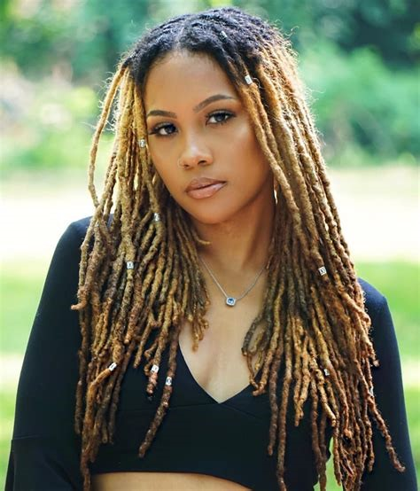
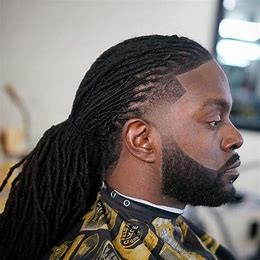
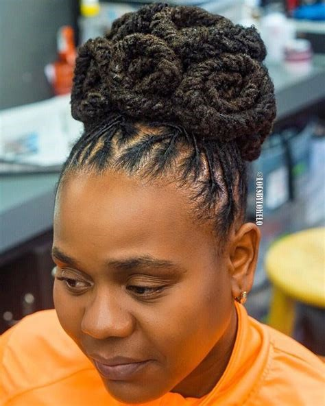

 <--https://apostle01.github.io/I-Three/-->

I-Three Dreadlocks Salon
Welcome to I-Three Dreadlocks Salon! Our salon showcases our expertise in dreadlocks styling. Whether you’re a client or just curious, this README will guide you through our project.

##Table of Contents

Introduction
Features
Installation
Usage
Contributing
License
Introduction

The purpose of the I-Three Dreadlocks Salon project is to create an online platform where clients can explore dreadlocks styling services, view a gallery of stunning transformations, and get in touch with the salon. Whether you’re interested in our services or simply curious, our website aims to provide a seamless experience for anyone seeking excellence in dreadlocks.
 
!Salon Image 
 
 
 
 

##Features
Home Page: Learn about our salon, our mission, and our commitment to excellence.

Packages: Explore our service packages, pricing, and special offers.
<ul>
<li>Starter</li>
<li>Maintainance</li>
<li>Styling Perfection</li>
<a href="Booking.html">Booking.html</a>
</ul>

Gallery: View stunning photos of our clients’ dreadlocks transformations.

<<<<<<< HEAD

=======

>>>>>>> 21d897296c368663f77626c55a8fd4185a25fff9

<video width="630" height="300" src="https://raw.githubusercontent.com/Apostle01/I-Three/main/assets/video/VideoEditor_HOW TO RETWISTDREADLOCKS WITH CROCHET LATCH HOOK.mp4"></video>

Booking: Reach out to us via email or the booking form.

##HTML Validator Screenshots of errors and correction.

##Validated with w3c JigSaw validator.

##Installation

Clone this repository to your local machine:

git clone https://github.com/Apostle01/I-Three-Dreadlocks-Salon.git

Navigate to the project directory:

cd I-Three-Dreadlocks-Salon

Install any necessary dependencies (if applicable).

##Usage
Open index.html in your web browser to explore the salon website.
Visit the different sections: Home, Packages, Gallery, and Contact.
Fill out the booking form to get in touch with us.

##Contributing
We welcome contributions from the community! If you’d like to improve our website, fix a bug, or add new features, follow these steps:

Fork this repository.

Create a new branch for your changes:

git checkout -b feature/your-feature-name

Make your changes and commit them:

git commit -m “Add your descriptive commit message”

Push your changes to your forked repository:

git push origin feature/Apostle01

Create a pull request to merge your changes into the main repository.

##License
This project is licensed under the MIT License.
