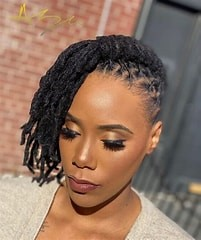

# I-Three Dreadlocks Salon

Welcome to I-Three Dreadlocks Salon! Our salon showcases our expertise in dreadlocks styling. Whether you're a client or just curious, this README will guide you through our project.

## Table of Contents

1. Introduction
2. Features
3. Installation
4. Usage
5. Contributing
6. License

## Introduction

I-Three Dreadlocks Salon is a place where clients can explore our services, view our gallery, and get in touch with us. Our website aims to provide a seamless experience for visitors interested in a touch of excellence with regards to dreadlocks.

!Salon Image
 
 
 
 

## Features

- **Home Page**: Learn about our salon, our mission, and our commitment to excellence.
- **Packages**: Explore our service packages, pricing, and special offers.
- **Gallery**: View stunning photos of our clients' dreadlocks transformations.

!Gallery

                

- **Contact**: Reach out to us via email or the contact form.

## Installation

1. Clone this repository to your local machine:

git clone https://github.com/Apostle01/I-Three-Dreadlocks-Salon.git

2. Navigate to the project directory:

cd I-Three-Dreadlocks-Salon

3. Install any necessary dependencies (if applicable).

## Usage

1. Open `index.html` in your web browser to explore the salon website.
2. Visit the different sections: Home, Packages, Gallery, and Contact.
3. Fill out the contact form to get in touch with us.

## Contributing

We welcome contributions from the community! If you'd like to improve our website, fix a bug, or add new features, follow these steps:

1. Fork this repository.
2. Create a new branch for your changes:

git checkout -b feature/your-feature-name

3. Make your changes and commit them:

git commit -m “Add your descriptive commit message”

4. Push your changes to your forked repository:

git push origin feature/Apostle01

5. Create a pull request to merge your changes into the main repository.

## License

This project is licensed under the MIT License.

