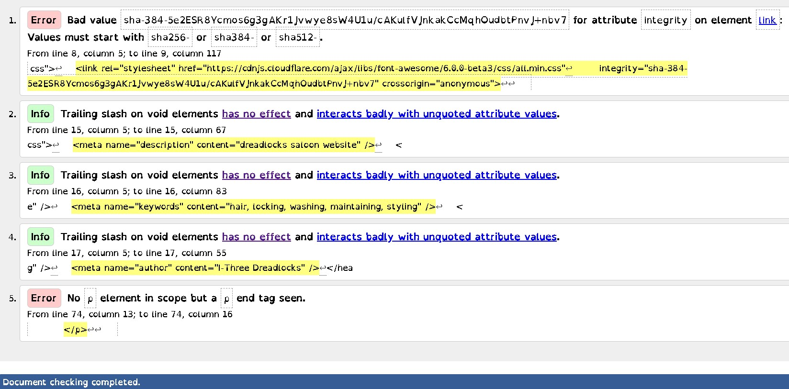

 https://apostle01.github.io/I-Three/

##Table of Contents

Introduction
Features
Installation
Usage
Contributing
License

User Experience (UX)
Introduction
I-Three Dreadlocks Salon
Welcome to I-Three Dreadlocks Salon! Our salon showcases our expertise in dreadlocks styling. Whether you’re a client or just curious, this README will guide you through our project.

 I-Three User Experience Principles
 The purpose of the I-Three Dreadlocks Salon project is to create an online platform where clients can explore dreadlocks styling services, view a gallery of stunning transformations, and get in touch with the salon. Whether you’re interested in our services or simply curious, our website aims to provide a seamless experience for anyone seeking excellence in dreadlocks.

At I-Three, we prioritize user experience (UX) as a fundamental aspect of our product development process. Our UX principles guide us in creating intuitive, efficient, and enjoyable experiences for our users. Here are the key principles we follow:
*User-Centric Design: I opted for this to cater for user needs, behaviors, and goals in the design process.
*Simplicity and Clarity: Was used to keep interfaces intuitive, easy to navigate, and visually clear.
*Consistency: To maintain uniformity in design elements and interaction patterns, consistency was employed.
*Accessibility and Inclusivity: Was used to make sure that all users can access the items by adhering to accessibility guidelines.
*Feedback and Responsiveness: Provide clear feedback for user actions and ensure responsiveness across devices.
*Emotional Engagement: Create experiences that evoke positive emotions and forge connections with users.
*Continuous Improvement: Iterate and refine products based on data, metrics, and user feedback for ongoing enhancement.

Design. Colour Scheme
Colour Selection: Utilise colour websites to choose background and foreground colours, ensuring accessibility for users with visual impairments.
Planned Alternative Text: Develop alternative text equivalents for non-text elements to accommodate visually impaired users.
Accessibility Considerations: Prioritize accessibility features to ensure inclusivity and usability for all users, including those with disabilities.
Inclusive Design: Implement design strategies that consider diverse user needs and abilities to create a universally accessible experience.
Testing and Feedback: Conduct thorough testing and gather feedback from users, including those with disabilities, to identify areas for improvement and ensure optimal accessibility.

##Salon Image 
I used images in the header to give visitors forehand knowledge of the eclusive service at I-Three dreadlocks salon.
 
 
 
 

##Features
The website consists of three pages and a modal. Home, Packages, Gallery and Booking modal.

All three pages have the following elements in common:
A responsive navigation bar at the top of the page allows the user to easily explore the website. On the right-hand side of the navigation bar are links to the packages page, gallery page and booking modal. To enable a positive user experience the navigation links are condensed into a burger toggler button on smaller devices. This was done to prevent the navigation bar from looking cluttered.
A footer that comprises of social media links to Facebook, Instagram, Twitter and Youtube. The footer also contains the address of the company.

##Home Page: Learn about our salon, our mission, and our commitment to excellence.
Four different images of clean styled dreadlocks in the header.
A heading and paragraph explaining who I-Three are.
Four different images of clean styled dreadlocks in the header.

##Packages: Explore our service packages, pricing, and special offers.
The three packages which are on offer to the user.
Text explaining the packages.
A book now button underneath the packages to allow the user easy access to the bookings modal.
<ul>
<li>Starter</li>
<li>Maintainance</li>
<li>Styling Perfection</li>
<a href="Booking.html">Booking.html</a>
</ul>

Gallery: View stunning photos of our clients’ dreadlocks transformations.
Text showing users what to expect from I-Three Dreadlocks Salon on the gallery page.
A grid gallery showcasing I-Three's completed work. This will give confidence to the user in the companies ability.

I included a video of retwisting dreadlocks taken from you-tube. 
<iframe width="338" height="602" src="https://www.youtube.com/embed/hnn5DJqowX4" title="Retwist Tips for starter locs"  allowfullscreen></iframe>

##Booking: Reach out to us via email or the booking form.
I have included a booking form for customers to reach us for inquiry or concerns. 
A where to find us section, displaying a map from Google and the companies address, email and phone number. The map on the Homepage points to a coffee house in Ireland. As Dhadda's Detailing is not a real business I opted to use the iframe link from the Coffee Coders project.

Accessibility
I've taken care when coding to make the website as user-friendly and as accessible as I can. I've accomplished this by:
Using semantic HTML.
Using descriptive alt attributes for images throughout the site.
Selecting a sans-serif font which is suitable for users with dyslexia.
Ensuring that the site has an adequate amount of colour contrast in regards to a "Dreadlocks Salon."

Technologies Used
Languages Used
HTML and CSS
Visual Studio Code IDE was used to create the website.
Git - For version control.
Github - To save and store the files for the website.
Bootstrap Version 4.2.1 - The framework for the website. Code for the navigation bar, modal and various other classes.
Google Fonts - To import the fonts used on the website.
Google Dev Tools - To troubleshoot and test features, and solve issues with responsiveness and styling.
Am I Responsive To show the website across a range of devices.
Fontawsome For social links.

##Installation
Deployment and Local Development
Deployment
Github Pages was used to deploy the live website. The instructions to achieve this are below:

Log in (or sign up) to Github.
Find the repository for this project, I-Three Dreadlocks Salon.
Click on the Settings link.
Click on the Pages link in the left-hand side navigation bar.
In the Source section, choose main from the drop-down select branch menu. Select Root from the drop-down select folder menu.
Click Save. Your live Github Pages site is now deployed at the URL shown.

Local Development
How to Fork
To fork the repository:

Log in (or sign up) to Github.
Go to the repository for this project, Apostle/I-Three
Click the Fork button in the top right corner.

Clone this repository to your local machine:
To do this, first copy code below:
git clone https://github.com/Apostle01/I-Three-Dreadlocks-Salon.git

Once the code is copied unto local machine, Navigate to the project directory:
copy code the code:
cd I-Three-Dreadlocks-Salon

##Usage
Open index.html in your web browser to explore the salon website.
Visit the different sections: Home, Packages, Gallery, and Contact.
Fill out the booking form to get in touch with us.

##Contributing
We welcome contributions from the community! If you’d like to improve our website, fix a bug, or add new features, follow these steps:

Fork this repository.
Create a new branch for your changes:
git checkout -b feature/your-feature-name
Make your changes and commit them:
git commit -m “Add your descriptive commit message”
Push your changes to your forked repository:
git push origin feature/Apostle01

Create a pull request to merge your changes into the main repository.

Testing
Testing was continuous throughout the website build. I used Chrome developer tools to identify and address any issues as they arose.

My mentor also pointed out that the images within the website were .png format which hindered the performance of the website. To combat this all images have been converted to .webp format to significantly improve performance.

On the Packages page. the list items were out of alignment and not centered even after using the bootstrap text-center class. This was due to padding, which has now been removed to center the list of items.

W3C Validator
W3C validator was used to validate the HTML on all pages of the website. It was also used to validate CSS in the style.css file.
Index Page HTML
Packages Page HTML
Gallery Page HTML
404 Page HTML
style.css CSS

##HTML Validator Screenshots of errors and correction.
To correct the errors in the code HTML and CSS validators are used with screenshots.Below are the validated codes screenshots.

##Validated with w3c JigSaw validator.

One issue I was coming across when testing my html page was an error displayed by w3. Trailing slash on void elements has no effect and interacts badly with unquoted attribute values.' However, even after removing these trailing slashes when saving my document Visual Studio Code would re-enter them. Luckily as w3 states these have no effect on the code.

Testing User Stories
First Time Visitors
I want to find out what services are on offer.

Users are able to navigate to other pages. Packages, gallery and booking models page of the website

Previous work can be viewed by visiting the gallery page. Gallery page of the website
I want to be able to navigate through the website with ease by clicking the link  <li><a href="gallery.html">Gallery</a></li>

The navigation bar at the top of the page allows easy navigation throughout the website.
<nav>
            <ul>
                <li><a href="index.html" class="active">Home</a></li>
                <li><a href="packages.html">Packages</a></li>
                <li><a href="gallery.html">Gallery</a></li>
                <li><a href="booking.html">Booking</a></li>
            </ul>
        </nav>

I want to be able to book/make contact.
User's can easily make a booking using the Book Now button. This button leads to a modal, which allows a user to select various options to make a booking. Upon a successful booking, the user is presented with a thank you message.
Booking Modal
<a href="Booking.html">Booking.html</a>

Wave Testing
Index Page HTML
Packages Page HTML
Gallery Page HTML
404 Page HTML
Full Testing
Full testing was performed on the following devices:

Laptop: Lenovo V15 G2 ITL

Mobile Devices:
iPhone 15 pro max.
iPhone 14 pro max.
Phone 12 pro
Each device tested the site using the following browsers:

Google Chrome
Safari
Home Page				
|Feature       |	Expected outcome                 |	Testing performed            |	Result      |  Pass/Fail|
|Site Nav links|	Link directs the user back to the home page|	Clicked title|	Home page reloads|	Pass|
|Package links |	Link directs user to Packages page|	Clicked link|	Package page loads|	Pass|
|Gallery link  |	Link directs user to Gallery page|	Clicked link|	Gallery page loads|	pass|
|Link hover effect|	All nav bar links highlight grey when hovered over|	Hover over each button on the page|		Pass|
|Social links  |	The corresponding social website opens on a new tab when clicked|	Clicked social links|	Social websites open in new tab|	Pass|
|Book now links|	Opens booking modal|	Clicked links  |	Booking Modal opens|	Pass|

Package Page
|Feature       |	Expected Outcome|	Testing Performed |	 Results	|Pass/Fail|
|Site nav links|	Link directs the user back to the home page|	Clicked title|	Home Page reloads|	Pass|
|Packages link |	Link directs user to packages page|	Clicked title|	Packages Page loads|	Pass|
|Gallery link  |	Link directs user to gallery page|	Clicked link|	Gallery Page loads|	Pass|
|Link hover effect|	All nav bar links highlight grey when hovered over|	Hover over each button on the page|	Each button turned grey when hovered over   |	Pass|
|Social links  | The corresponding social website opens on a new tab when clicked| Clicked social links |Social website opens in new tab            |	Pass  |
|Book now link |	Opens booking modal|	Clicked links|	Booking Modal opens|	Pass|

Gallery Page
|Feature       |	Expected Outcome|	Testing Performed|	Results|	Pass/Fail|
|Site nav links|	Link directs the user back to the home page|	Clicked link|	Home Page reloads|	Pass|
|Packages link |	Link directs user to packages page|	Clicked link|	Packages Page loads|	Pass|
|Gallery link  |	Link directs user to gallery page|	Clicked link|	Gallery Page loads|	Pass|
|Link hover effect|	All nav bar links highlight grey when hovered over|	Hover over each button on the page|	Each button turned grey when hovered over   |	Pass|
|Social links  |	The corresponding social website opens on a new tab when clicked|	Clicked social links|	Social website opens in new tab|	Pass|
|Book now link |	Opens booking modal|	Clicked links|	Booking Modal opens|	Pass|

404 Page
|Feature       |	Expected Outcome|	Testing Performed|	Results	|Pass/Fail|
|Site nav links|	Link directs the user back to the home page|	Clicked link|	Home Page reloads|	Pass|
|Packages link |	Link directs user to packages page|	Clicked link|	Packages Page loads|	Pass|
|Gallery link  |	Link directs user to gallery page|	Clicked link|	Gallery Page loads|	Pass|
|Link hover effect|	All nav bar links highlight grey when hovered over|	Hover over each button on the page|	Each button turned grey when hovered over   |	Pass|
|Social links  |	The corresponding social website opens on a new tab when clicked|	Clicked social links|	Social website opens in new tab|	Pass   |
|Book now link|	Opens booking modal|	Clicked links|	Booking Modal opens|	Pass|

Booking Modal
|Feature       |	Expected Outcome|	Testing Performed  |	Result              |Pass/Fail|
|Book Button   |Opens| confirmation modal|	Clicked button|	Confirmation modal opens|	Pass|
|Close Button  |	Closes modal   |	Clicked button     |	Modal closes   |	Pass    |
						
##Acknowledgments
My cohort for support.
Code Institute for informative course material.
The Slack community for help and support.
##Code Used
I've used code and classes courtesy of Bootstrap.

##Media
All my media was taken from Unsplash.
A video from you-tube was included with iframe.

##License
This project is licensed under the MIT License.
